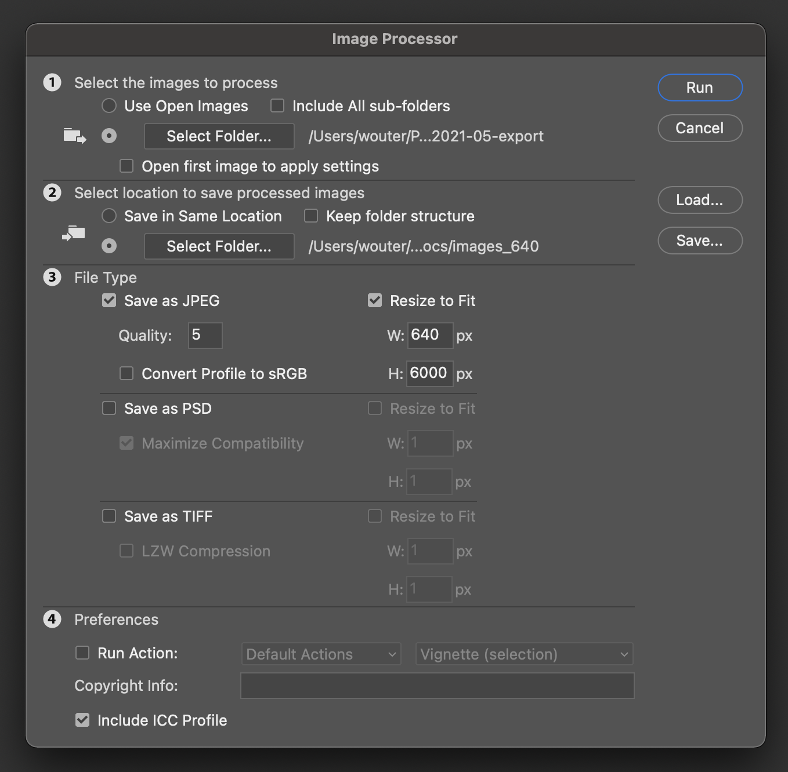
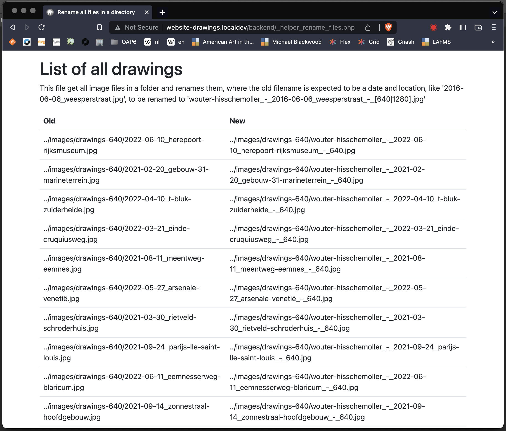
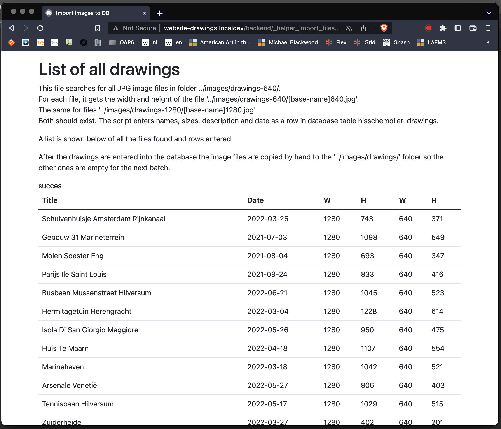

# Website Drawings

Page built with Vue, TypeScript and PHP on hisschemoller.com to show my drawings.

http://www.hisschemoller.com/drawings

## Foto's van tekeningen maken

* In plastic verpakt de plaat museumglas en stuk wit karton met aanleghoek.
* Microfoon statief met daarop de camera met schroefdraad adapter stukje.
* Lijmklemmen, houten latjes.


## Foto's bewerken

Alle foto's zoveel mogelijk in dezelfde positie en met dezelfde belichting gefotografeerd. Alle
in dezelfde folder opgeslagen.

### Originele foto's in PSB bestand

* Photoshop: File > Scripts > Load Files into Stack...
  * Use: Folder
  * Browse...
  * Foto's verschijnen als layers.
* Guides om uiterste rand van alle tekening pagina's.
* Image rotation, zo nodig.
* Opslaan als Large Document Format *psb* bestand. Photoshop stelt dit voor als het bestand te
groot blijkt te worden bij opslaan.


### Bijgesneden foto's in PSB bestand

* Openen kan minuten lang duren bij een bestand van 2,5 GB.
* Bijsnijden, ruim, met Crop Tool.
* Individuele pagina's eventueel roteren en gelijk leggen aan de guides.
* Opslaan onder een nieuwe naam als *psb* bestand.


### Elke tekening in een laag in PSD bestand

* Pagina's verdelen in tekeningen per laag.
* Elke tekening de datum en titel als naam van de laag.
  * yyyy-mm-dd_locatie-van-de-tekening
* Opslaan onder een nieuwe naam als *psd* bestand.


### Kleur correctie

* Photoshop Actions maken met levels, exposure, hue, saturation.
  * Verschillende voor boven en onder zo nodig.
* Laag voor laag een Action toepassen en zo nodig nog bijstellen.
* Opslaan onder een nieuwe naam als *psd* bestand.


### Export layers als files

Photoshop File > Export > Layers to Files...

* Geen prefix
* Bestandstype PNG
* Geen transparantie
* Trim Layers

Standaard laat Photoshop zelfs zonder prefix elke bestandsnaam nog steeds voorafgaan door
underscores en een viercijferig getal. Om dat ook uit te zetten:

Applications/Adobe Photoshop 2023/Presets/Scripts/Export Layers To Files.jsx

en daarin:

```javascript
// fileNameBody += "_" + zeroSuppress(i, 4);
// fileNameBody += "_" + layerName;
fileNameBody += layerName;
```

### Bestanden schalen en converteren van PNG naar JPG

Met de Photoshop File > Script > Image Processor.<br>
Elke afbeelding in 640 en 1280 pixels breedte.<br>
JPG kwaliteit 5 (van 12).<br>
Twee mappen voor de twee breedtes:<br>
*public/images/drawings-640/* en *public/images/drawings-1280/*<br>



### Bestandsnamen aanpassen

Met http://website-drawings.localdev/backend/_helper_rename_files.php<br>
Zie informatie hieronder in Local Development - Backend.<br>



### Importeren in database

Met http://website-drawings.localdev/backend/_helper_import_files.php<br>
De breedte en hoogte van zowel de 640 als 1280 versie worden gemeten.<br>
De beschrijving en datum worden uit de bestandsnaam gehaald.<br>
Daarmee worden rijen in de database tabel hisschemoller_drawings gemaakt.<br>
De tabel heeft al defaults voor de lengte- en breedtegraad.<br>



### Locatie en beschrijving

Afbeeldingen te kiezen in *http://website-drawings.localdev/backend/list.php*<br>
Locatie, beschrijving en datum te bewerken in *http://website-drawings.localdev/backend/edit.php*<br>


## Local development

### Frontend

To set up and run the Vue frontend:

```
yarn install
yarn dev
```

In *src/store/index.ts* set `state.env = 'dev'`.<br>
Frontend running at http://localhost:8080/<br>

### Backend

Use MAMP, point virtual host *website-drawings.localdev* to *public/* in this project.

### Database table

<table cellspacing="0" class="nowrap" border="2">
<thead><tr><td>Column</td><td>TypeComment</td></tr></thead>
<tbody>
<tr><td>id</td><td><span title="">smallint(6)</span> <i>Auto Increment</i></td></tr>
<tr class="odd"><td>image_file_large</td><td><span title="utf8mb3_general_ci">varchar(255)</span></td></tr>
<tr><td>width_large</td><td><span title="">int(6)</span></td></tr>
<tr class="odd"><td>height_large</td><td><span title="">int(6)</span>
</td></tr><tr><td>image_file_small</td><td><span title="utf8mb3_general_ci">varchar(255)</span>
</td></tr><tr class="odd"><td>width_small</td><td><span title="">int(6)</span>
</td></tr><tr><td>height_small</td><td><span title="">int(6)</span>
</td></tr><tr class="odd"><td>latitude</td><td><span title="">decimal(8,6)</span> <span title="Default value">[<b>52.370434</b>]</span>
</td></tr><tr><td>longitude</td><td><span title="">decimal(9,6)</span> <span title="Default value">[<b>4.901212</b>]</span>
</td></tr><tr class="odd"><td>title</td><td><span title="utf8mb3_general_ci">varchar(50)</span> <i>NULL</i>
</td></tr><tr><td>description</td><td><span title="utf8mb3_general_ci">varchar(255)</span> <i>NULL</i>
</td></tr><tr class="odd"><td>date</td><td><span title="">date</span>
</td></tr></tbody></table>

### Edit table

http://website-drawings.localdev/backend/api.php<br>
Just dump the whole drawings table.

http://website-drawings.localdev/backend/edit.php<br>
Edit a drawing, its coordinates.

http://website-drawings.localdev/backend/list.php<br>
List of all drawings with edit links.

### Edit table helpers

http://website-drawings.localdev/backend/_helper_edit_table.php

This file shows a list of all entries in the hisschemoller_drawings database table where the
latitude and longitude are both 0. It also immediately sets them to default values.

When entering coordinates for new drawings using Openstreetmaps it's handy to only have to adjust
their position from a location that is already nearby.

### Import files helper

http://website-drawings.localdev/backend/_helper_import_files.php

This file searches for all png image files in folder ../images/drawings-640/.<br>
For each file, it gets the width and height of the file
'../images/drawings-640/[base-name]640.png'.<br>
The same for files '../images/drawings-1280/[base-name]1280.png'.<br>
Both should exist. The script enters names, sizes, description and date as a row in database table
*hisschemoller_drawings*.<br>
<br>
A list is shown below of all the files found and rows entered.<br>
<br>
After the drawings are entered into the database the image files are copied by hand to the
'../images/drawings/' folder so the other ones are empty for the next batch.

### Rename files helper

http://website-drawings.localdev/backend/_helper_rename_files.php

This file get all image files in a folder and renames them, where the old filename is expected to be
a date and location, like '2016-06-06_weesperstraat.png', which would be renamed to 'wouter-hisschemoller_-_2016-06-06_weesperstraat_-_[640|1280].png'

### Resize files helper

http://website-drawings.localdev/backend/_helper_resize_files.php

This file get all image files in a folder, resizes them to 1280 px width, renames them from
'filename.png' to 'filename_-_1280.png' and saves them to '../images/drawings-1280/'.
